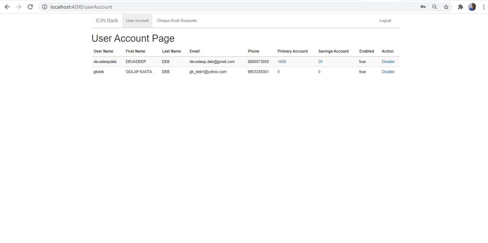

# AdminPortal

This project was generated with [angular-cli](https://github.com/angular/angular-cli) version 1.0.0-beta.28.3.

## Development server
Run `ng serve` for a dev server. Navigate to `http://localhost:4200/`. The app will automatically reload if you change any of the source files.

## Code scaffolding

Run `ng generate component component-name` to generate a new component. You can also use `ng generate directive/pipe/service/class/module`.

## Build

Run `ng build` to build the project. The build artifacts will be stored in the `dist/` directory. Use the `-prod` flag for a production build.

## Running unit tests

Run `ng test` to execute the unit tests via [Karma](https://karma-runner.github.io).

## Running end-to-end tests

Run `ng e2e` to execute the end-to-end tests via [Protractor](http://www.protractortest.org/).
Before running the tests make sure you are serving the app via `ng serve`.

## Deploying to GitHub Pages

Run `ng github-pages:deploy` to deploy to GitHub Pages.

## Further help

To get more help on the `angular-cli` use `ng help` or go check out the [Angular-CLI README](https://github.com/angular/angular-cli/blob/master/README.md).

## Deployment via Jenkins

I have used my personal laptop Jenkins application to run it.

Deployment steps are available in <a href="https://github.com/devadeepdeb/AdminPortal/blob/master/Jenkinsfile">Jenkinsfile</a>

Issued command "java -jar jenkins.war" where jenkins.war is installed to launch jenkins

It opened on port 8080. Installed docker plugins from Maven and created a multipipeline project named "AdminBanking"

Configured it as below.

<h3>Deployment Steps on AWS EC2 instance</h3>
<pre>
1)  I used https://github.com/devadeepdeb/AdminPortal
2)	I went to AWS Web Console https://us-east-1.console.aws.amazon.com/console/home?region=us-east-1# and selected EC2 in Services
3)	Then I created instance by clicking on “EC2 Dashboard” and then “Launch Instance”.
4)	I chose “Amazon Linux 2 AMI (HVM), SSD Volume Type” and “t2 micro type” and proceeded with default settings of “Configure Instance”, “Add Storage”, “Add Tags”.
5)	In “Configure Security Group” I clicked on “Add Rule” to add Type “All traffic” and Source “Anywhere” to be visisble to everyone without any access restriction.
6)	Then clicked on “Review and Launch” to launch instance . The instance will come in “Running State”
7)	Click on “Instances” to see the running Instance ID and note down the Public Ipv4 for my running instance.
8)	Select the Instance and click on “Connect” to open https://console.aws.amazon.com/ec2/v2/connect/ec2-user/yourinstance (EC2 SSH instance or machine)
9)	Install maven (yum update –y,  yum install docker –y), git (yum install git –y), docker (yum install docker  –y), on EC2 SSH instance and check versions of git (git –version), docker (docker –version), maven (mvn –v) to confirm.
10)	SSH as root user in EC2 SSH instance i.e “sudo –i”
11)	Write command git clone git://github.com/devadeepdeb/AdminPortal.git in EC2 SSH instance
12)	Start docker in EC2 SSH instance (systemctl start docker)
13)	Create Jenkins job to Fetch changes from the remote Git repository https://github.com/devadeepdeb/AdminPortal
14)	Cd to path where git repository was cloned
15)	Write “docker build -t adminportal .” to create docker  image on above cloned repo
16)	Write “docker run -d -p 4200:80 adminportal” to run the angular app on AWS EC2 instance.
17)	Now open http://54.197.30.224:5001/ to host Angular application docker container on AWS EC2 instance for end users.
18)	Loaded application screenshot is as below (I have only deployed in AWS EC2 instance. We also need to change springboot consuming api urls accordingly. I have not used Jenkins in AWS deployment)

